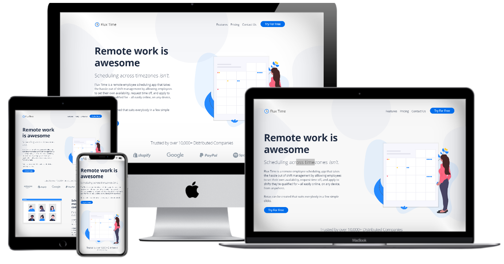
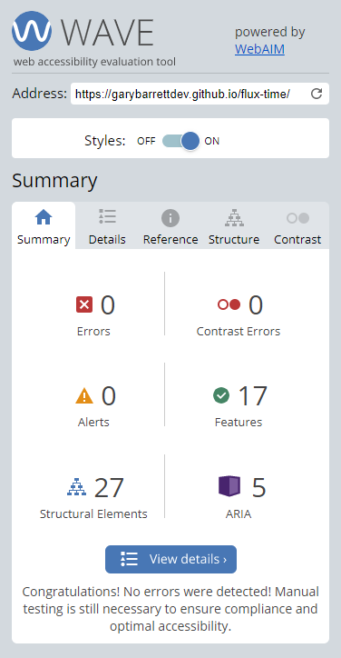

<h1  align="center">Flux Time </h1>

[View the live project here.](https://garybarrettdev.github.io/flux-time/)

 This is a site for a fictitious [SaaS company](https://en.wikipedia.org/wiki/Software_as_a_service) that makes a remote employee scheduling app called Flux Time.
 
It is designed to be responsible and accessible on a range of devices, making it easy to navigate for potential customers.



## Table of Contents

* [Site Owner and Business Goals](https://github.com/GaryBarrettDev/flux-time#site-owner-and-business-goals)
* [User Experience](https://github.com/GaryBarrettDev/flux-time#user-experience-ux)

    * [User stories](https://github.com/GaryBarrettDev/flux-time#user-stories)
    * [First Time Visitor Goals](https://github.com/GaryBarrettDev/flux-time#first-time-visitor-goals)
    * [Returning and Frequent Visitor Goals](https://github.com/GaryBarrettDev/flux-time#returning-and-visitor-goals)

* [Design](https://github.com/GaryBarrettDev/flux-time#design)
    * [Colour Scheme](https://github.com/GaryBarrettDev/flux-time#colour-scheme)
    * [Typography](https://github.com/GaryBarrettDev/flux-time#typography)
    * [Imagery](https://github.com/GaryBarrettDev/flux-time#imagery)
    * [Visual Hierarchy and Conversion Rate Optimisation](https://github.com/GaryBarrettDev/flux-time#visual-hierarchy-and-conversion-rate-optimisation)
    * [Wireframes](https://github.com/GaryBarrettDev/flux-time#wireframes)
    * [Features](https://github.com/GaryBarrettDev/flux-time#features)
    * [technologies used](https://github.com/GaryBarrettDev/flux-time#technologies-used)
    * [languages used](https://github.com/GaryBarrettDev/flux-time#languages-used)
    * [Frameworks, Libraries & Programs Used](https://github.com/GaryBarrettDev/flux-time#frameworks-libraries--programs-used)

* [Testing](https://github.com/GaryBarrettDev/flux-time#testing)

     * [Code validation](https://github.com/GaryBarrettDev/flux-time#code-validation)
     * [Accessibility Testing](https://github.com/GaryBarrettDev/flux-time#accessibility-testing)
    * [Responsive Testing](https://github.com/GaryBarrettDev/flux-time#responsive-testing)
    * [Further Testing](https://github.com/GaryBarrettDev/flux-time#further-testing)
    * [Testing User Stories from User Experience (UX) Section](https://github.com/GaryBarrettDev/flux-time#testing-user-stories-from-user-experience-ux-section)
     * [First Time Visitor Goals](https://github.com/GaryBarrettDev/flux-time#first-time-visitor-goals-1)
     * [Known Bugs](https://github.com/GaryBarrettDev/flux-time#known-bugs)
    * [Deployment](https://github.com/GaryBarrettDev/flux-time#deployment)
  

 *  [Credits](https://github.com/GaryBarrettDev/flux-time#credits)
    * [Media](https://github.com/GaryBarrettDev/flux-time#media)    
    * [Content](https://github.com/GaryBarrettDev/flux-time#content)
    * [Code](https://github.com/GaryBarrettDev/flux-time#code)
    * [Acknowledgements](https://github.com/GaryBarrettDev/flux-time#acknowledgements)


----


## Site Owner and Business Goals

As the site owner, I want my website to act as the main marketing channel for my product.

The goal of the site is to present my product and company in the best possible way so that visitors
will be encouraged to sign-up to use my product.

The site needs to present information in a clear manner so that visitors can make an informed
decision about whether my product is suitable for them.

The site also needs a way for visitors to contact us if they have any additional questions about the product.

---
  

## User Experience (UX)

### User stories

As the owner of a [distributed company](https://en.wikipedia.org/wiki/Distributed_workforce) with remote workers 
in several different countries and timezones, 
scheduling rotas and organising Zoom meetings has become increasingly frustrating.

While services like Calendly.com can help two people organise times that suit both parties, it's not a solution 
that scales when dozens or hundreds of people need to schedule periods that overlap.

I'm looking for a solution to this problem that can scale and is cost effective.

 #### First Time Visitor Goals

As a First Time Visitor:

1. I want my first impression of the site's design to be positive.  

2.  I want to know if this company and site are trustworthy and credible.

3. I want to easily understand the main purpose of the product and service 
being provided.

4. I want to know how much this product costs and what are the differences between 
the price plans.

5. I want to know how I can contact the company if I have questions or need support.

6. I want to see if the company is active on social media.

7. I want to know how I can start using the product.


  
#### Returning and Frequent Visitor Goals

As a Returning and Frequent visitor:

1. I want to know how I can contact the company so I can ask them questions and get support.

2. I want to know how I can keep track of product and company updates on social media.


  ___

### Design

#### Colour Scheme

The main colours used are blue, light blue, and white. 

-  `#006DEB`
-  `#F6F7FA`


According to an article on [the science of colour persuasion](https://idealogicbrandlab.com/color-persuasion/):

> (Blue suggests)..trust, loyalty, dependability, logic, security, and serenity. Provides a sense of security and stimulates productivity. 

#### Typography

Open Sans is the main font used throughout the whole website with Sans Serif as the fallback font. According to [Google](https://fonts.google.com/specimen/Open+Sans#glyphs):
>(Open sans)...was optimized for print, web, and mobile interfaces, and has excellent legibility characteristics in its letterforms.


 #### Imagery
 
Illustrated hero images are used as part of a modern, flat aesthetic to provide a calming and welcoming experience for visitors. Scalable vector graphics (svg's) are used to ensure images remain sharp at all screen sizes while keeping page load times to a minimum.

The site also uses abstract images of blobs and waves, which are a [modern trend in web design](https://bashooka.com/inspiration/examples-of-blob-shapes-in-web-design/). The curves of these images helps to conteract the harsh "Lego block" aesthetic of default Bootstrap, creating a more enjoyable and friendly user experience.

#### Visual Hierarchy and Conversion Rate Optimisation

The site uses a clear [visual hierarchy](https://www.interaction-design.org/literature/topics/visual-hierarchy) to help both the site owner and visitors to the site achieve their goals. This includes:

1. Learning details about what the product and service do.
2. Seeing examples of other companies that use the product to build trust and credibility.
3. Understanding the cost and differences between price plans.
4. A form to help get access to the product.
5. A contact form if the visitor has any questions.

All of the information is presented on one page without the need to click to additional pages.

Consistent and repeated call to action buttons are intended to help the site owner convert visitors into customers.

___  

 ### Wireframes

  

- [Desktop Wireframe](./assets/images/desktop-wireframe.png)
  

- [Mobile Wireframe](./assets/images/mobile-wireframe.png)

  

## Features


* Responsive menu with call to action button
    * The navigation menu uses Bootstrap's javascript to create a toggle and collapses on mobile devices, 
    providing an excellent user experience on smaller screens.
    * The menu links to different sections on the same page using 
    [CSS smooth scrolling](https://github.com/GaryBarrettDev/flux-time/blob/master/assets/css/style.css#L1) 
    to prevent the page movement from being harsh and abrupt for users.
    * One of menu links contains a "call to action" that is designed to stand out from the other menu items, 
    encouraging users to fulfill the site owners goal of converting users into customers.

* Hero Sections with product details and illustrations
    * The text in the hero sections tries to evoke empathy with users by sympathising with a problem they face, while also detailing how the product
    on offer might help them. The blue colour scheme and 
    graphics aim to create a calm and peaceful experience.

*   Logo Section
    * The purpose of displaying logos from companies that use the service is to act as social proof and reassure users that the company
    is reputable and trustworthy.

*  Pricing cards
    * The pricing cards provide users with a clear comparison of the costs for the service 
    based on the numbers of employees a business has.

* 30 Day Trial Form
    * This form is intentionally kept simple with a minimal number of required fields to improve conversion rates.
    UX studies have demonstrated a clear
     [correlation between the number of fields and conversions](https://blog.hubspot.com/blog/tabid/6307/bid/6746/Which-Types-of-Form-Fields-Lower-Landing-Page-Conversions.aspx). Keeping the form simple also prevents
    users from becoming frustrated or overburdened. The form fields are validated and have helpful notices and placeholders.
     
* Contact Form
    * Similar to the form for the trial, the contact form fields are validated, have helpful notices, and placeholders. This means that if a user
    tries to submit a message with uses a properly formated email address, they'll be notified of their mistake.

* Social icons in the footer
    * The Font Awesome icons in the footer provide an easy way for users to follow or contact the company on social media. It also allows
    users to see how the company interacts with other people.


## Technologies Used

### Languages Used

-  [HTML5](https://en.wikipedia.org/wiki/HTML5)

-  [CSS3](https://en.wikipedia.org/wiki/Cascading_Style_Sheets)

### Frameworks, Libraries & Programs Used


 [Bootstrap 4.6.0:](https://getbootstrap.com/docs/4.6/getting-started/introduction/)

- Bootstrap was used to assist with the responsiveness and styling of the website. Extensive use of Bootstraps utility classes reduced the need for custom CSS, which should help with maintainability.

[Font Awesome 5.15.0:](https://fontawesome.com/)

- Font Awesome was used to create the social icons in the footer.

 [Google Fonts:](https://fonts.google.com/)

- Google Fonts was used to add 'Open Sans' to body text. Instead of using @import to load the fonts in style.css, files are linked to in site's head to improve load times, and to prevent possible flashes of unstyled text (FOUT), which would create a poor user experience.

 [jQuery:](https://jquery.com/)

- jQuery used by Bootstrap for the collapsible mobile menu.

[Git](https://git-scm.com/)

- Git was used for version control by utilizing the Gitpod terminal to commit to Git and Push to GitHub.

[GitHub:](https://github.com/)

- GitHub is used to store the projects code after being pushed from Git.

[Blobmaker App:](https://www.blobmaker.app/)

- Blobmaker App was used to create the abstract blob images.

 [Abobe Illustrator:](https://www.adobe.com/ie/products/illustrator.html)

- Illustrator was used to combine indivdual images from Blobmaker  into a single background image for the body.

[Get Waves:](https://www.getwaves.io/)

- Get Waves was used to create the wave image in the site's footer.

[Balsamiq:](https://balsamiq.com/)

- Balsamiq was used to create wireframes during the design process.

---

## Testing

  ### Code validation

The W3C HTML Validator and W3C CSS Validator Services were used to validate the project to ensure there were no syntax errors in the project.

-  [W3C Markup Validator](https://validator.w3.org) - [Results](https://validator.w3.org/nu/?doc=https%3A%2F%2Fgarybarrettdev.github.io%2Fflux-time%2F)

-  [W3C CSS Validator](https://jigsaw.w3.org/css-validator/#validate_by_input) - [Results](./assets/images//w3c-validator-results.png)

___

### Accessibility Testing

[Google Lighthouse](https://developers.google.com/web/tools/lighthouse) and [WAVE Web Accessibility Evaluation Tool](https://wave.webaim.org/) were used to test the site's accessibility. 

Three issues arose during testing:

1. A lack of contrast on buttons ([fixed here](https://github.com/GaryBarrettDev/flux-time/commit/bc1494de20f1bbce98020e3481731379e0680989)).
2. Headings were out of sequential order ( [fixed here](https://github.com/GaryBarrettDev/flux-time/commit/8c37cad0f15fe89d18fd1ceda153554e0fde8de4)).
3. Absence of labels on forms ( [fixed here](https://github.com/GaryBarrettDev/flux-time/commit/e3c3b3539fd3830379774840d8847e59967bbff2)).

All issues were fixed and scores were perfect on the final tests. Google Lighthouse even had fireworks animations to celebrate.

The site was also tested manually to make sure that it was navigable by using the tab key, ensuring elements had correct focus states.




___
### Responsive Testing

The site's repsonsiveness was tested using:

- [Google's Mobile Friendly Tester](https://search.google.com/test/mobile-friendly) - [Results](./assets/images/google-mobile-friendly-test.png)
-  [Responsinator](https://www.responsinator.com/) - [Results](https://www.responsinator.com/?url=https%3A%2F%2Fgarybarrettdev.github.io%2Fflux-time%2F)
- [Chrome DevTools' Device Mode](https://developers.google.com/web/tools/chrome-devtools/device-mode)

The site was also tested by manually resizing the browser to check for any issues at uncommon screen sizes.

No known issues were found.

---

### Further Testing

- Form validation was tested to make sure all required fields function correctly.
- The navigation menu and anchor links were tested in Brave, Chrome, Firefox, and Edge.
- Footer social icon links were tested to make sure they open in another tab.

___

### Testing User Stories from User Experience (UX) Section

#### First Time Visitor Goals


1. I want my first impression of the site's design to be positive.

    1. Upon entering the site, users are automatically greeted with a clean, modern, flat aesthetic and hero illustrations.
    2. Colours are complementary and pleasing.
    3. Text is easy to read.
    4. Anchor links in the menu make it easy to navigate between different sections of the site.
    
 

2. I want to know if this company and site are trustworthy and credible.

    1. Seeing a list of logos from companies that use the product acts as [social proof](https://en.wikipedia.org/wiki/Social_proof) and instills trust and confidence
        in the site and company.
    2. Links to the businesses social media accounts in the footer allows visitors to see how responsive
        the company is to customer queries in public. 
    3. The presence of a contact form creates trust by letting visitors know they have a way of contacting the company if
        they have questions or need support.
    4. The repetition and consistent messages in call to action buttons and section titles about there being a free trial without
     requiring a credit card reassures visitors that they have nothing to lose by signing up for a trial.


3. I want to easily understand the main purpose of the product and service 
being provided.

    1. The hero sections clearly describe the problem that the product hopes to solves.
    2.  If anything is unclear, there is a contact form visitors can use if they have any questions.

4. I want to know how much this product costs and what are the differences between 
the price plans.

    1. Pricing cards provide information on which plan is best suited for a
     company based on the number of employees they have.

5. I want to know how I can contact the company if I have questions or need support.

    1. There is a "Contact Us" button in the navigation menu that links directly to the section with the contact form.
    2. Social Media links in the footer provide another method visitors can use if they want to 
    reach out and talk to the company.

6. I want to see if the company is active on social media.
    1. Links to the companies social media accounts can be found in the footer.

7. I want to know how I can start using the product.
    1. There are several bright call to action buttons that lead the visitor to a sign-up form that they can use to gain acces to the product,
     including a prominent button in the navigation menu.

  

 #### Returning and Frequent Visitor Goals

1. I want to know how I can contact the company so I can ask them questions and get support.

    1. There's a "Contact Us" link in the header that links to the section of the page with the contact form.

2. I want to know how I can keep track of product and company updates on social media.
   1. Social media links in the footer allow visitors to follow the company when they post updates.
  

### Bugs encountered

- Chrome DevTools giving a 404 error for a missing favicon ([fixed here](https://github.com/GaryBarrettDev/flux-time/commit/1d1571df1b81ba65b45cfc66866202d3386b2d28)] 
- Google Lighthouse reporting that using `target="_blank"` without `rel="noopener"`can be a security vulnerability 
([fixed here](https://github.com/GaryBarrettDev/flux-time/commit/236b0c0f92ea078cbd1fc0637f08795d6dc577ac))

I also experienced bugs with Gitpod when trying to push commits to Github. This seems to have been an issue 
on Gitpod's end with their servers. There were a handful of times when commits were only partially pushed.


  ### Known Bugs

There are no known bugs in the deployed site.

----

## Deployment

### GitHub Pages

The project was deployed to GitHub Pages using the following steps...

1. Log in to GitHub and locate the [Flux Time GitHub Repository](https://github.com/GaryBarrettDev/flux-time)

2. At the top of the Repository (not top of page), locate the "Settings" Button on the menu.

3. Scroll down the Settings page until you locate the "GitHub Pages" Section.

4. Under "Source", click the dropdown called "None" and select "Master Branch".

5. The page will automatically refresh.

6. Scroll back down through the page to locate the now published site in the "GitHub Pages" section.

  

### Forking the GitHub Repository

  

By forking the GitHub Repository we make a copy of the original repository on our GitHub account to view and/or make changes without affecting the original repository by using the following steps:

  

1. Log in to GitHub and locate the [Flux Time GitHub Repository](https://github.com/GaryBarrettDev/flux-time)

2. At the top of the Repository (not top of page) just above the "Settings" Button on the menu, locate the "Fork" Button.

3. You should now have a copy of the original repository in your GitHub account.

  

### Making a Local Clone

  

1. Log in to GitHub and locate the [Flux Time GitHub Repository](https://github.com/GaryBarrettDev/flux-time)

2. Under the repository name, click "Clone or download".

3. To clone the repository using HTTPS, under "Clone with HTTPS", copy the link.

4. Open Git Bash

5. Change the current working directory to the location where you want the cloned directory to be made.

6. Type `git clone`, and then paste the URL you copied in Step 3.

  

```

$ git clone https://github.com/GaryBarrettDev/flux-time

```

  

7. Press Enter. Your local clone will be created.

  

```

$ git clone https://github.com/GaryBarrettDev/flux-time

> Cloning into `CI-Clone`...

> remote: Counting objects: 10, done.

> remote: Compressing objects: 100% (8/8), done.

> remove: Total 10 (delta 1), reused 10 (delta 1)

> Unpacking objects: 100% (10/10), done.

```

  

Click [Here](https://help.github.com/en/github/creating-cloning-and-archiving-repositories/cloning-a-repository#cloning-a-repository-to-github-desktop) to retrieve pictures for some of the buttons and more detailed explanations of the above process.

 --- 

## Credits

  

### Media

-  [unDraw.co](https://undraw.co): For the illustrated hero images. unDraw is a great source for free open-source illustrations.

-  [Wikimedia Commons](https://commons.wikimedia.org/wiki/File:Icons8_flat_clock.svg): Flux Time header logo.

- [Blob Maker App](https://www.blobmaker.app/):  Blob background images.

-  [Get Waves](https://www.getwaves.io/): Wave image in the footer.

-   [Seek Logo](https://seeklogo.com/): Brand logos.

### Content

- Content on the site was adapted from [Spacetime.am](https://spacetime.am) and [Papershift.com](https://www.papershift.com/en/schedule)

- [Code Institute](https://github.com/Code-Institute-Solutions/SampleREADME): I used their sample [README.md](https://github.com/Code-Institute-Solutions/SampleREADME) as the basis for mine.


### Code

 - [Bootstrap 4](https://getbootstrap.com/docs/4.4/getting-started/introduction/): Bootstrap Library used throughout the project mainly to make site responsive using the Bootstrap Grid System. Code for the site's navbar was adapted from [Bootstrap's docs](https://getbootstrap.com/docs/4.0/components/navbar/). 
 
- [Fabrx.co](https://fabrx.co/muze/snippets/pricing.html): Adapted HTML for the pricing cards.


### Acknowledgements

- My mentor Antonio Rodriguez for feedback and positive encouragement.

- Everyone in Slack.  Any time I ran into an issue with Gitpod, I found that someone had already asked the same question before, and had recieve an answer or solution. It's a great resource I'd be lost without.

