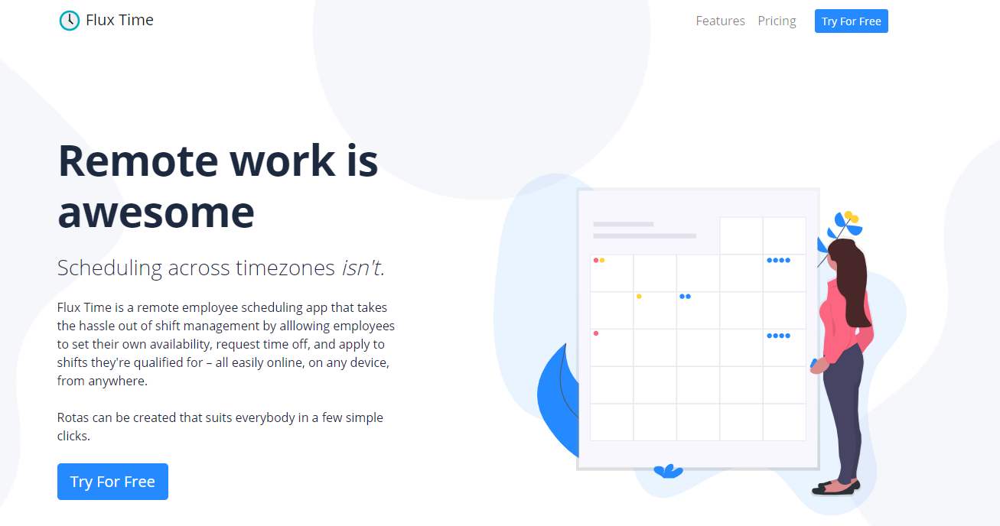

<h1 align="center">Flux Time Website</h1>

[View the live project here.](https://garybarrettdev.github.io/flux-time/)

This is the main marketing website for Flux Time, a remote employee scheduling app. It is designed to be responsibe and accessible on a range of devices, making it easy to navigate for potential customers.



## User Experience (UX)

-   ### User stories

    -   #### First Time Visitor Goals

        1. As a First Time Visitor, I want to easily understand the main purpose of the product and service being provided.
        2. As a First Time Visitor, I want to be
        3. 

    -   #### Returning Visitor Goals


    -   #### Frequent User Goals

-   ### Design
    -   #### Colour Scheme
        -   The two main colours used are blue and navy
        -   The Roboto font is the main font used throughout the whole website with Sans Serif as the fallback font in case for any reason the font isn't being imported into the site correctly. Roboto is a clean font used frequently in programming, so it is both attractive and appropriate.
    -   #### Imagery
        -   Imagery is important. The large illustrations are designed to be striking and catch the user's attention. It also has a modern, flat aesthetic.

*   ### Wireframes

    -   Desktop Wireframe - 

    -   Mobile Wireframe - 

## Features

-   Responsive on all device sizes


## Technologies Used

### Languages Used

-   [HTML5](https://en.wikipedia.org/wiki/HTML5)
-   [CSS3](https://en.wikipedia.org/wiki/Cascading_Style_Sheets)

### Frameworks, Libraries & Programs Used

1. [Bootstrap 4.4.1:](https://getbootstrap.com/docs/4.4/getting-started/introduction/)
    - Bootstrap was used to assist with the responsiveness and styling of the website.
1. [Google Fonts:](https://fonts.google.com/)
    - Google fonts were used to add the 'Robot' font into the head.
1. [jQuery:](https://jquery.com/)
    - jQuery came with Bootstrap to make the navbar responsive but was also used for the smooth scroll function in JavaScript.
1. [Git](https://git-scm.com/)
    - Git was used for version control by utilizing the Gitpod terminal to commit to Git and Push to GitHub.
1. [GitHub:](https://github.com/)
    - GitHub is used to store the projects code after being pushed from Git.
1. [Illustrator:](https://www.adobe.com/ie/products/illustrator.html)
    - Illustrator was used to create the blob background image for the website.
1. [Balsamiq:](https://balsamiq.com/)
    - Balsamiq was used to create the [wireframes](https://github.com/) during the design process.

## Testing

The W3C Markup Validator and W3C CSS Validator Services were used to validate every page of the project to ensure there were no syntax errors in the project.

-   [W3C Markup Validator](https://jigsaw.w3.org/css-validator/#validate_by_input) 
-   [W3C CSS Validator](https://jigsaw.w3.org/css-validator/#validate_by_input) - 

### Testing User Stories from User Experience (UX) Section

-   #### First Time Visitor Goals

-   #### Returning Visitor Goals

-   #### Frequent User Goals

    

### Further Testing


### Known Bugs


## Deployment

### GitHub Pages

The project was deployed to GitHub Pages using the following steps...

1. Log in to GitHub and locate the [GitHub Repository](https://github.com/)
2. At the top of the Repository (not top of page), locate the "Settings" Button on the menu.
    - Alternatively Click [Here](https://raw.githubusercontent.com/) for a GIF demonstrating the process starting from Step 2.
3. Scroll down the Settings page until you locate the "GitHub Pages" Section.
4. Under "Source", click the dropdown called "None" and select "Master Branch".
5. The page will automatically refresh.
6. Scroll back down through the page to locate the now published site [link](https://github.com) in the "GitHub Pages" section.

### Forking the GitHub Repository

By forking the GitHub Repository we make a copy of the original repository on our GitHub account to view and/or make changes without affecting the original repository by using the following steps...

1. Log in to GitHub and locate the [GitHub Repository](https://github.com/)
2. At the top of the Repository (not top of page) just above the "Settings" Button on the menu, locate the "Fork" Button.
3. You should now have a copy of the original repository in your GitHub account.

### Making a Local Clone

1. Log in to GitHub and locate the [GitHub Repository](https://github.com/)
2. Under the repository name, click "Clone or download".
3. To clone the repository using HTTPS, under "Clone with HTTPS", copy the link.
4. Open Git Bash
5. Change the current working directory to the location where you want the cloned directory to be made.
6. Type `git clone`, and then paste the URL you copied in Step 3.

```
$ git clone https://github.com/YOUR-USERNAME/YOUR-REPOSITORY
```

7. Press Enter. Your local clone will be created.

```
$ git clone https://github.com/YOUR-USERNAME/YOUR-REPOSITORY
> Cloning into `CI-Clone`...
> remote: Counting objects: 10, done.
> remote: Compressing objects: 100% (8/8), done.
> remove: Total 10 (delta 1), reused 10 (delta 1)
> Unpacking objects: 100% (10/10), done.
```

Click [Here](https://help.github.com/en/github/creating-cloning-and-archiving-repositories/cloning-a-repository#cloning-a-repository-to-github-desktop) to retrieve pictures for some of the buttons and more detailed explanations of the above process.

## Credits

### Media

-   The illustrated hero images came from [unDraw.co](https://undraw.co). unDraw provides awesome open-source illustrations for free.
-   The Flux Time logo came from [Wikimedia Commons](https://commons.wikimedia.org/wiki/File:Icons8_flat_clock.svg)
-   The blobs background image was created with [Blob Maker App](https://www.blobmaker.app/). 

### Content

-   Content on the site was adapted from [Spacetime.am](https://spacetime.am) and [Papershift.com](https://www.papershift.com/en/schedule)

### Code

-   [Bootstrap4](https://getbootstrap.com/docs/4.4/getting-started/introduction/): Bootstrap Library used throughout the project mainly to make site responsive using the Bootstrap Grid System.

### Acknowledgements

-   My Mentor for continuous helpful feedback.

-   Tutor support at Code Institute for their support.