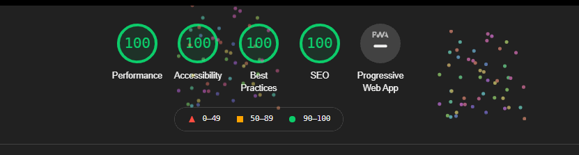

<h1  align="center">Flux Time </h1>

[View the live project here.](https://garybarrettdev.github.io/flux-time/)

 This is a site for a ficticious company and remote employee scheduling app called Flux Time.
 
It is designed to be responsibe and accessible on a range of devices, making it easy to navigate for potential customers.


## Site Owner Goals and Brief


  

## User Experience (UX)

  

-  ### User stories

  

-  #### First Time Visitor Goals

  

1. As a First Time Visitor, I want to easily understand the main purpose of the product and service being provided.

2. As a First Time Visitor, I want to be

3.

  

-  #### Returning Visitor Goals

  
  

-  #### Frequent User Goals

  ___

### Design

#### Colour Scheme

The main colours used are blue and light gray. According to an article on [the science of colour persuasion](https://idealogicbrandlab.com/color-persuasion/):

> (Blue suggests)..trust, loyalty, dependability, logic, security, and serenity. Provides a sense of security and stimulates productivity. 

#### Typography

Open Sans is the main font used throughout the whole website with Sans Serif as the fallback font. According to [Google](https://fonts.google.com/specimen/Open+Sans#glyphs):
>(Open sans)...was optimized for print, web, and mobile interfaces, and has excellent legibility characteristics in its letterforms.


 #### Imagery
 
Illustrated hero images are used as part of a modern, flat aesthetic to provide a calming and welcoming experience for visitors. Scalable vetor graphics (svg's) are used to ensure images remain sharp at all screen sizes while keeping page load times to a minimum.

The site also uses abstract images of blobs and waves, which are a [modern trend in web design](https://bashooka.com/inspiration/examples-of-blob-shapes-in-web-design/). The curves of these images helps to conteract the harsh "Lego block" aesthetic of default Bootstrap, creating a more enoyable and friendly user experience.

#### Visual Hierarchy and Conversion Rate Optimisation

The site uses a clear [visual hierarchy](https://www.interaction-design.org/literature/topics/visual-hierarchy) to help both the site owner and visitors to the site achieve their goals. This includes:

1. Learning details about what the product and service does.
2. Seeing examples of other companies that use the product to build trust and credibility.
3. Understanding the cost and differences beteen price plans.
4. A form to help get acces to the product.
5.  A contact form if the vistor has any questions.

All of the information is presented on one page without the need to click to additonal pages.

Consistent and repeated call to action buttons are intended to help the site owner convert visitors into customers.

___  

 ### Wireframes

  

- [Desktop Wireframe](./assets/images/desktop-wireframe.png)
  

- [Mobile Wireframe](./assets/images/mobile-wireframe.png)

  

## Features

  

- Responsive on all device sizes

  
  

## Technologies Used

### Languages Used

-  [HTML5](https://en.wikipedia.org/wiki/HTML5)

-  [CSS3](https://en.wikipedia.org/wiki/Cascading_Style_Sheets)

### Frameworks, Libraries & Programs Used


 [Bootstrap 4.6.0:](https://getbootstrap.com/docs/4.6/getting-started/introduction/)

- Bootstrap was used to assist with the responsiveness and styling of the website. Extensive use of Bootstraps utility classes reduced the need for custom CSS, which should help with maintainability.

[Font Awesome 5.15.0:](https://fontawesome.com/)

- Font Awesome was used to create the social icons in the footer.

 [Google Fonts:](https://fonts.google.com/)

- Google Fonts was used to add 'Open Sans' to body text. Instead of using @import to load the fonts in style.css, the files are linked to in site's head to improve load times, and to prevent possible flashes of unstyled text (FOUT), which would create a poor user experience.

 [jQuery:](https://jquery.com/)

- jQuery came with Bootstrap to make the navbar responsive.

[Git](https://git-scm.com/)

- Git was used for version control by utilizing the Gitpod terminal to commit to Git and Push to GitHub.

[GitHub:](https://github.com/)

- GitHub is used to store the projects code after being pushed from Git.

[Blobmaker App:](https://www.blobmaker.app/)

- Blobmaker App was used to create the abstract blob images.

 [Abobe Illustrator:](https://www.adobe.com/ie/products/illustrator.html)

- Illustrator was used to combine indivual images from Blobmaker  into a single background image for the body.

[Get Waves:](https://www.getwaves.io/)

- Get Waves was used to create the wave image in the site's footer.

[Balsamiq:](https://balsamiq.com/)

- Balsamiq was used to create wireframes during the design process.

## Testing

  ### Code validation

The W3C HTML Validator and W3C CSS Validator Services were used to validate the project to ensure there were no syntax errors in the project.

-  [W3C Markup Validator](https://validator.w3.org) - [Results](https://validator.w3.org/nu/?doc=https%3A%2F%2Fgarybarrettdev.github.io%2Fflux-time%2F)

-  [W3C CSS Validator](https://jigsaw.w3.org/css-validator/#validate_by_input) - [Results](./assets/images//w3c-validator-results.png)

___

### Accessibility Testing

[Google Lighthouse](https://developers.google.com/web/tools/lighthouse) and [WAVE Web Accessibility Evaluation Tool](https://wave.webaim.org/) were used to test the site's accessibility. 

Three issues arose during testing:

1. A lack of contrast on buttons
2. Headings were out of sequential order
3. Absence of labels on forms

All issues were fixed and scores were perfect on the final tests. Google Lighthouse even had fireworks animations to celebrate.

The site was also tested manually to make sure that it was navigable by using the tab key, ensuring elements had correct focus states.




___
### Responsive Testing

The sites repsoniveness was tested using:

- [Google's Mobile Friendly Tester](https://search.google.com/test/mobile-friendly) - [Results](./assets/images/google-mobile-friendly-test.png)
-  [Responsinator](https://www.responsinator.com/) - [Results](https://www.responsinator.com/?url=https%3A%2F%2Fgarybarrettdev.github.io%2Fflux-time%2F)
- [Chrome DevTools' Device Mode](https://developers.google.com/web/tools/chrome-devtools/device-mode)

The site was also tested by manually resizing the browser to check for any issues at uncomon screen sizes.

No known issues were found.

___

### Testing User Stories from User Experience (UX) Section

  

-  #### First Time Visitor Goals

  

-  #### Returning Visitor Goals

  

-  #### Frequent User Goals

  

  

### Further Testing
The site was tested on  my own phone, tablet, and laptop to make that 
menu and anchor links functioned correctly. The site was test in Brave, Chrome, Firefox, and Edge.
  

### Known Bugs

There are no known bugs.

## Deployment

### GitHub Pages

The project was deployed to GitHub Pages using the following steps...

1. Log in to GitHub and locate the [Flux Time GitHub Repository](https://github.com/GaryBarrettDev/flux-time)

2. At the top of the Repository (not top of page), locate the "Settings" Button on the menu.

3. Scroll down the Settings page until you locate the "GitHub Pages" Section.

4. Under "Source", click the dropdown called "None" and select "Master Branch".

5. The page will automatically refresh.

6. Scroll back down through the page to locate the now published site in the "GitHub Pages" section.

  

### Forking the GitHub Repository

  

By forking the GitHub Repository we make a copy of the original repository on our GitHub account to view and/or make changes without affecting the original repository by using the following steps:

  

1. Log in to GitHub and locate the [Flux Time GitHub Repository](https://github.com/GaryBarrettDev/flux-time)

2. At the top of the Repository (not top of page) just above the "Settings" Button on the menu, locate the "Fork" Button.

3. You should now have a copy of the original repository in your GitHub account.

  

### Making a Local Clone

  

1. Log in to GitHub and locate the [Flux Time GitHub Repository](https://github.com/)

2. Under the repository name, click "Clone or download".

3. To clone the repository using HTTPS, under "Clone with HTTPS", copy the link.

4. Open Git Bash

5. Change the current working directory to the location where you want the cloned directory to be made.

6. Type `git clone`, and then paste the URL you copied in Step 3.

  

```

$ git clone https://github.com/YOUR-USERNAME/YOUR-REPOSITORY

```

  

7. Press Enter. Your local clone will be created.

  

```

$ git clone https://github.com/YOUR-USERNAME/YOUR-REPOSITORY

> Cloning into `CI-Clone`...

> remote: Counting objects: 10, done.

> remote: Compressing objects: 100% (8/8), done.

> remove: Total 10 (delta 1), reused 10 (delta 1)

> Unpacking objects: 100% (10/10), done.

```

  

Click [Here](https://help.github.com/en/github/creating-cloning-and-archiving-repositories/cloning-a-repository#cloning-a-repository-to-github-desktop) to retrieve pictures for some of the buttons and more detailed explanations of the above process.

  

## Credits

  

### Media

-  [unDraw.co](https://undraw.co): For the illustrated hero images. unDraw is a great source for free open-source illustrations.

-  [Wikimedia Commons](https://commons.wikimedia.org/wiki/File:Icons8_flat_clock.svg): Flux Time header logo.

- [Blob Maker App](https://www.blobmaker.app/):  Blob background images.

-  [Get Waves](https://www.getwaves.io/): Wave image in the footer.

-   [Seek Logo](https://seeklogo.com/): Brand logos.

### Content

- Content on the site was adapted from [Spacetime.am](https://spacetime.am) and [Papershift.com](https://www.papershift.com/en/schedule)

- [Code Institute](https://github.com/Code-Institute-Solutions/SampleREADME): I used their sample [README.md](https://github.com/Code-Institute-Solutions/SampleREADME) as the basis for mine.


### Code

 - [Bootstrap 4](https://getbootstrap.com/docs/4.4/getting-started/introduction/): Bootstrap Library used throughout the project mainly to make site responsive using the Bootstrap Grid System. Code for the sites navbar was adapted from [Bootstraps docs](https://getbootstrap.com/docs/4.0/components/navbar/). 
 
- [Fabrx.co](https://fabrx.co/muze/snippets/pricing.html): Adapted HTML for the pricing cards.


### Acknowledgements

- My mentor Antonio Rodriguez for feedback and positive encouragement.

- Everyone in Slack.  Any time I ran into an issue with Gitpod, I found that someone had already asked the same question before, and had recieve an answer or solution. It's a great resource I'd be lost without.